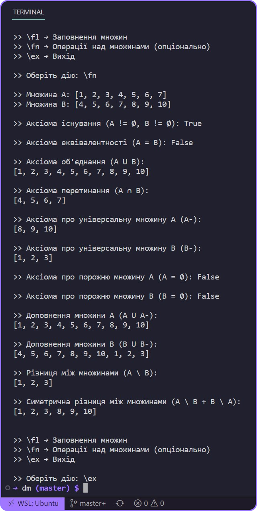
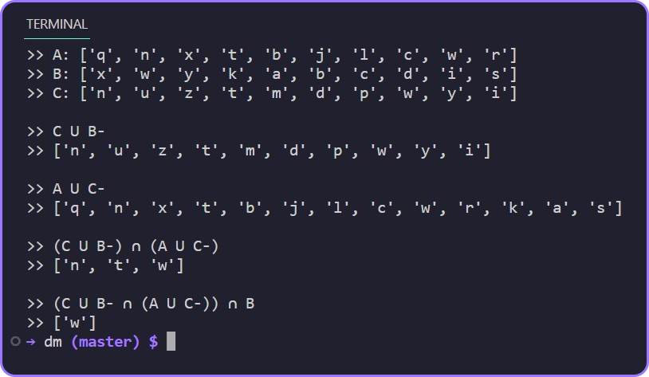

# Лабораторна робота 1

### **Тема:** «Теорія множин».
### **Мета:** вивчити основні аксіоми, закони і теореми теорії множин, навчитися  застосовувати їх на практиці.   

## Завдання: написати програму, яка буде виконувати будь-які операції над множинами.
- **Вимоги до програмного забезпечення**:
    1.	Модульна структура програми;
    2.	Уведення даних із клавіатури і з зовнішнього файлу;
    3.	Перевірка  коректності введених даних;
    4.	Меню.
- **Основні аксіоми теорії множин**:
    1. Аксіома існування (A != Ø B != Ø)
    2. Аксіома еквівалентності (A = B)
    3. Аксіома об'єднання (A U B)
    4. Аксіома перетинання (A ∩ B)
    5. Аксіома про універсальну множину (A-)
    6. Аксіома про порожню множину (A = Ø )
- Виходячи з основних аксіом, визначені **додаткові операції над множинами**:
    7. Доповнення множини (A U A- )
    8. Різниця між множинами (A \ B)
    9. Симетрична різниця між множинами  (А \ В + В \ А)
---
## Програма: [DMLab1.py](https://github.com/77696C6C69616D/DMLabs/blob/master/DMLab1.py)
---
## Результат:

---

# Лабораторна робота 2

### **Тема**: «Функції теорії множин».
### **Мета**: вивчити основні аксіоми, закони і теореми теорії множин, навчитися застосовувати їх на практиці.   

- ## Завдання: 
    1. Виконати обчислення по заданій формулі;
    2. скласти алгоритм і написати програму, що буде обчислювати функцію  множин (згідно свого  варіанта, приведеного в таблиці 3);

Варіант 7: 

---
## Програма: [DMLab2.py](https://github.com/77696C6C69616D/DMLabs/blob/master/DMLab2.py)
---
## Результат:

---

# Лабораторна робота 3

### **Тема**: Канонічні форми логічних функцій. Довершені кнф, днф.
### **Мета**: вивчити логічні функції двох змінних, навчитися одержувати досконалу диз'юнктивну нормальну форму й досконалу кон’юктивну нормальну форму та  приводити функцію до заданого базису.

## Завдання: 
- Для заданого варіанта логічної функції потрібно скласти алгоритм та програму, що дозволяють виконувати наступні дії:
    - а) реалізовувати логічні функції двох змінних;
    - б) побудувати таблицю істинності для заданої функції (довільної);
    - в) побудувати досконалу диз'юнктивну нормальну форму (ДДНФ) і досконалу кон’юктивну нормальну форму (ДКНФ) для заданої у індивідуальних завданнях функції (а також довільної);
    - Зробити аналіз роботи програми за допомогою розрахунку таблиці істинності заданої функції.
---
## Програма: [DMLab3.py](https://github.com/77696C6C69616D/DMLabs/blob/master/DMLab3.py)
---
## Результат:

---

# Лабораторна робота 4
---

### **Тема:** Матричні способи подання графів
### **Мета:** Вивчення матричних способів подання графів

- ## Завдання: 
    1.	Одержати завдання у викладача у вигляді одного із двох способів матричного подання графа:а) матриця суміжності; б) матриця інцидентності
    2.	Скласти алгоритм програми, що реалізує переклад із заданого способу матричного подання графа в інший.
    3.	Створити програму, що реалізує переклад із заданого способу матричного подання графа в іншій. Передбачити консольне введення вхідних даних і висновок результатів роботи програми на екран.
---
## Програма: [DMLab4.py](https://github.com/77696C6C69616D/DMLabs/blob/master/DMLab4.py) 
---
## Результат:

---

# Лабораторна робота 5
---

### **Тема:** Матриці відстаней графів
### **Мета:** Вивчення алгоритмів пошуку діаметра, радіуса графів, пошук периферійних точок графа

- ## Завдання: 
    - Створити програму, що реалізує знаходження діаметра, радіуса, центральних та периферійних вершини графу
---
## Програма: [DMLab5.py](https://github.com/77696C6C69616D/DMLabs/blob/master/DMLab5.py)  
---
## Результат:

---
